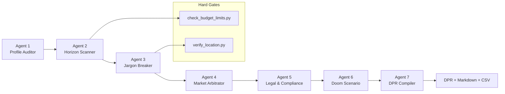

# R2B Pipeline Architecture

```mermaid
flowchart LR
  A[Agent 1\nProfile Auditor] --> B[Agent 2\nHorizon Scanner]
  B --> C[Agent 3\nJargon Breaker]
  C --> D[Agent 4\nMarket Arbitrator]
  D --> E[Agent 5\nLegal & Compliance]
  E --> F[Agent 6\nDoom Scenario]
  F --> G[Agent 7\nDPR Compiler]
  subgraph Hard Gates
    HG1[check_budget_limits.py]
    HG2[verify_location.py]
  end
  B --> HG1
  C --> HG2
  G --> Output[DPR + Markdown + CSV]
```